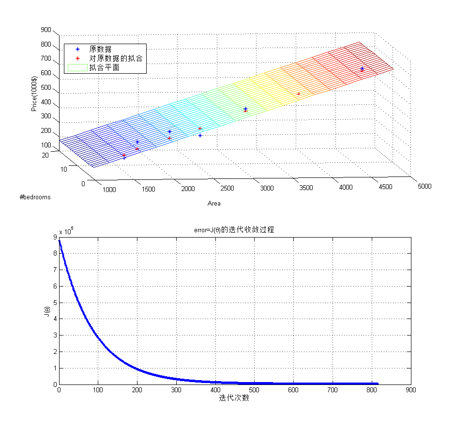
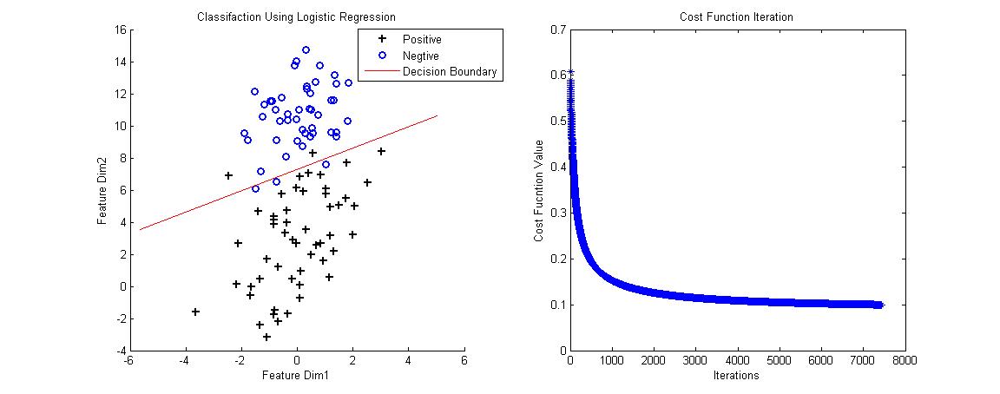

<!---title:Stanford机器学习课程笔记1-监督学习-->
<!---keywords:Maching Learning-->
<!---date:2015-04-08-->

Stanford机器学习课程的主页是： <http://cs229.stanford.edu/> 

## 课程计划

主讲人Andrew Ng是机器学习界的大牛，创办最大的公开课网站[coursera](www.coursera.org)，前段时间还听说加入了百度。他讲的机器学习课程可谓每个学计算机的人必看。整个课程的大纲大致如下：

1. Introduction (1 class) Basic concepts. 
2. Supervised learning. (6 classes) 
	Supervised learning setup. LMS.
	Logistic regression. Perceptron. Exponential family.
	Generative learning algorithms. Gaussian discriminant analysis. 	
	Naive Bayes.
	Support vector machines.
	Model selection and feature selection.
	Ensemble methods: Bagging, boosting, ECOC. 
3. Learning theory. (3 classes) 
	Bias/variance tradeoff. Union and Chernoff/Hoeffding bounds.
	VC dimension. Worst case (online) learning.
	Advice on using learning algorithms. 
4. Unsupervised learning. (5 classes) 
	Clustering. K-means.
	EM. Mixture of Gaussians.
	Factor analysis.
	PCA. MDS. pPCA.
	Independent components analysis (ICA). 	 
5. Reinforcement learning and control. (4 classes) 
	MDPs. Bellman equations.
	Value iteration. Policy iteration.
	Linear quadratic regulation (LQR). LQG.
	Q-learning. Value function approximation.
	Policy search. Reinforce. POMDPs. 

本笔记主要是关于Linear Regression和Logistic Regression部分的学习实践记录。

## Linear Regression与预测问题

举了一个房价预测的例子，

| Area(feet^2) | #bedrooms | Price(1000$) |
| ------------ | --------- | ------------ |
| 2014 | 3 | 400 |
| 1600 | 3 | 330 |
| 2400 | 3 | 369 |
| 1416 | 2 | 232 |
| 3000 | 4 | 540 |
| 3670 | 4 | 620 | 
| 4500 | 5 | 800 |

Assume：房价与“面积和卧室数量”是线性关系，用线性关系进行放假预测。因而给出线性模型， $h_{\theta}(x)=\sum{\theta^Tx}$ ，其中 $x=[x_1,x_2]$ , 分别对应面积和卧室数量。 为得到预测模型，就应该根据表中已有的数据拟合得到参数 $\theta$ 的值。课程通过从概率角度进行解释（主要用到了大数定律即“线性拟合模型的误差满足高斯分布”的假设，通过最大似然求导就能得到下面的表达式）为什么应该求解如下的最小二乘表达式来达到求解参数的目的，


上述 $J(\theta)$ 称为cost function， 通过 $minJ(\theta)$ 即可得到拟合模型的参数。

解 $minJ(\theta)$ 的方法有多种， 包括Gradient descent algorithm和Newton's method，这两种都是运筹学的数值计算方法，非常适合计算机运算，这两种算法不仅适合这里的线性回归模型，对于非线性模型如下面的Logistic模型也适用。除此之外，Andrew Ng还通过线性代数推导了最小均方的算法的闭合数学形式，

 

Gradient descent algorithm执行过程中又分两种方法：batch gradient descent和stochastic gradient descent。batch gradient descent每次更新 $\theta$ 都用到所有的样本数据，而stochastic gradient descent每次更新则都仅用单个的样本数据。两者更新过程如下：

1. batch gradient descent

	

2. stochastic gradient descent 

	for i=1 to m
	
	

两者只不过一个将样本放在了for循环上，一者放在了\sum上求和。事实证明，只要选择合适的学习率 $\alpha$ , Gradient descent algorithm总是能收敛到一个接近最优值的值。学习率选择过大可能造成cost function的发散，选择太小，收敛速度会变慢。

关于收敛条件，Andrew Ng没有在课程中提到更多，我给出两种收敛准则：

1. J小于一定值收敛
2. 两次迭代之间的J差值，即|J-J_pre|<一定值则收敛

下面是使用batch gradient descent拟合上面房价问题的例子，

```matlab
clear all;
clc

%% 原数据
x = [2014, 1600, 2400, 1416, 3000, 3670, 4500;...
    3,3,3,2,4,4,5;];
y = [400 330 369 232 540 620 800];

error = Inf;
threshold = 4300;
alpha = 10^(-10);
x = [zeros(1,size(x,2)); x];  % x0 = 0，拟合常数项
theta = [0;0;0]; % 常数项为0
J = 1/2*sum((y-theta'*x).^2);
costs = [];
while error > threshold
    tmp = y-theta'*x;
    theta(1) = theta(1) + alpha*sum(tmp.*x(1,:));
    theta(2) = theta(2) + alpha*sum(tmp.*x(2,:));
    theta(3) = theta(3) + alpha*sum(tmp.*x(3,:));
%     J_last = J;
    J = 1/2*sum((y-theta'*x).^2);
%     error = abs(J-J_last);
    error = J;
    costs =[costs, error];
end

%% 绘制
figure,
subplot(211);
plot3(x(2,:),x(3,:),y, '*');
grid on;
xlabel('Area');
ylabel('#bedrooms');
zlabel('Price(1000$)');

hold on;
H = theta'*x;
plot3(x(2,:),x(3,:),H,'r*');

hold on
hx(1,:) = zeros(1,20);
hx(2,:) = 1000:200:4800;
hx(3,:) = 1:20;
[X,Y] = meshgrid(hx(2,:), hx(3,:));
H = theta(2:3)'*[X(:)'; Y(:)'];
H = reshape(H,[20,20]);
mesh(X,Y,H);

legend('原数据', '对原数据的拟合', '拟合平面');

subplot(212);
plot(costs, '.-');
grid on
title('error=J(\theta)的迭代收敛过程');
xlabel('迭代次数');
ylabel('J(\theta)');
```

拟合及收敛过程如下：



不管是梯度下降，还是线性回归模型，都是工具！！分析结果更重要，从上面的拟合平面可以看到，影响房价的主要因素是面积而非卧室数量。

很多情况下，模型并不是线性的，比如股票随时间的涨跌过程。这种情况下， $h_{\theta}(x)=\theta^Tx$ 的假设不再成立。此时，有两种方案：

1. 建立一个非线性的模型，比如指数或者其它的符合数据变化的模型
2. 局部线性模型，对每段数据进行局部建立线性模型。Andrew Ng课堂上讲解了Locally Weighted Linear Regression，即局部加权的线性模型

### Locally Weighted Linear Regression


其中权值的一种好的选择方式是：


## Logistic Regression与分类问题

Linear Regression解决的是连续的预测和拟合问题，而Logistic Regression解决的是离散的分类问题。两种方式，但本质殊途同归，两者都可以算是指数函数族的特例。

在分类问题中，y取值在{0,1}之间，因此，上述的Liear Regression显然不适应。修改模型如下


该模型称为Logistic函数或Sigmoid函数。为什么选择该函数，我们看看这个函数的图形就知道了，


Sigmoid函数范围在[0,1]之间，参数 $\theta$ 只不过控制曲线的陡峭程度。以0.5为截点，>0.5则y值为1，< 0.5则y值为0，这样就实现了两类分类的效果。

假设 $P(y=1|x;\theta)=h_{\theta}(x)$ ， $P(y=0|x;\theta)=1-h_{\theta}(x)$ , 写得更紧凑一些，


对m个训练样本，使其似然函数最大，则有


同样的可以用梯度下降法求解上述的最大值问题，只要将最大值求解转化为求最小值，则迭代公式一模一样，


最后的梯度下降方式和Linear Regression一致。我做了个例子（[数据集链接](../enclosure/Stanford机器学习课程笔记1-监督学习/LogisticInput.txt)），下面是Logistic的Matlab代码，

```
function Logistic

clear all;
close all
clc

data = load('LogisticInput.txt');
x = data(:,1:2);
y = data(:,3);

% Plot Original Data
figure,
positive = find(y==1);
negtive = find(y==0);
hold on
plot(x(positive,1), x(positive,2), 'k+', 'LineWidth',2, 'MarkerSize', 7);
plot(x(negtive,1), x(negtive,2), 'bo', 'LineWidth',2, 'MarkerSize', 7);

% Compute Likelihood(Cost) Function
[m,n] = size(x);
x = [ones(m,1) x];
theta = zeros(n+1, 1);
[cost, grad] = cost_func(theta, x, y);
threshold = 0.1;
alpha = 10^(-1);
costs = [];
while cost > threshold
    theta = theta + alpha * grad;
    [cost, grad] = cost_func(theta, x, y);
    costs = [costs cost];
end

% Plot Decision Boundary 
hold on
plot_x = [min(x(:,2))-2,max(x(:,2))+2];
plot_y = (-1./theta(3)).*(theta(2).*plot_x + theta(1));
plot(plot_x, plot_y, 'r-');
legend('Positive', 'Negtive', 'Decision Boundary')
xlabel('Feature Dim1');
ylabel('Feature Dim2');
title('Classifaction Using Logistic Regression');

% Plot Costs Iteration
figure,
plot(costs, '*');
title('Cost Function Iteration');
xlabel('Iterations');
ylabel('Cost Fucntion Value');

end

function g=sigmoid(z)
g = 1.0 ./ (1.0+exp(-z));
end

function [J,grad] = cost_func(theta, X, y)
% Computer Likelihood Function and Gradient
m = length(y); % training examples
hx = sigmoid(X*theta);
J = (1./m)*sum(-y.*log(hx)-(1.0-y).*log(1.0-hx));
grad = (1./m) .* X' * (y-hx);
end
```


判决边界(Decesion Boundary)的计算是令h(x)=0.5得到的。当输入新的数据，计算h(x)：h(x)>0.5为正样本所属的类，h(x)< 0.5 为负样本所属的类。

我们再回过头来看Logistic问题：对于非线性的问题，只不过使用了一个叫Sigmoid的非线性映射成一个线性问题。那么，除了Sigmoid函数，还有其它的函数可用吗？Andrew Ng老师还讲了指数函数族。


