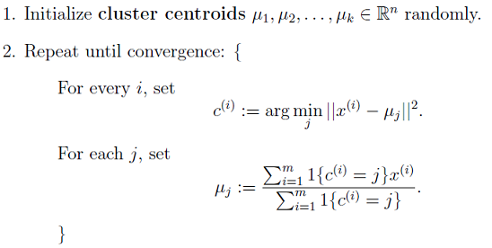
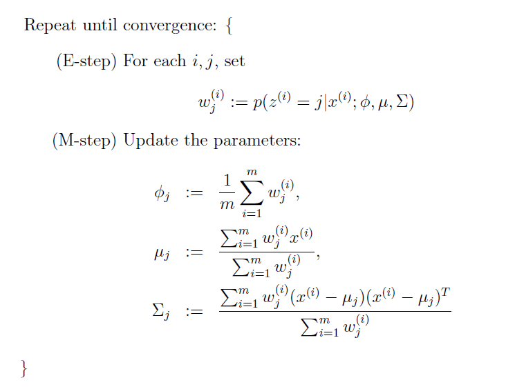

<!---title:Stanford机器学习课程笔记4-Kmeans与高斯混合模型-->
<!---keywords:机器学习-->
<!---date:2014-05-15-->

这一部分属于无监督学习的内容，无监督学习内容主要包括：Kmeans聚类算法、高斯混合模型及EM算法、Factor Analysis、PCA、ICA等。本文是Kmeans聚类算法、高斯混合模型的笔记，EM算法是适用于存在latent/hidden变量的通用算法，高斯混合模型仅仅是EM算法的一种特殊情况，关于EM算法的推到参见Andrew Ng讲义。由于公式太多，最近时间又忙实习的事就简单写一些，回头看时还得参考Ng的笔记和自己的打印Notes上的笔记，这里的程序对理解可能能提供另外的一些帮助。

## Kmeans聚类

其实聚类算法除了Kmeans，还有其它的聚类方式，记得曾经接触到的就有层次聚类、基于模糊等价关系的[模糊聚类](http://blog.csdn.net/xiahouzuoxin/article/details/7748823)。Kmeans只不过是这些聚类算法中最为常见的一中，也是我用得最多的一种。Kmeans本身的复杂度也高（O(N^3)），因此Kmeans有很多其它的变种：

1. 针对浮点型数据的运算，为提高运算效率，将浮点型Round成整形（我操作的话一般先乘一个系数，以使数据分布在整个整数空间，降低Round的数据损失）
2. 层次化的Kmeans聚类(HIKM)

这两种改进都能在[VLFeat](http://www.vlfeat.org/)里见到C代码实现。作为完善基础知识，我还是愿意先来复习下最基本的Kmeans聚类，后面再根据自己的经验补充点HIKM的东西。这是Stanford机器学习课程中第一个非监督学习算法，为严谨一些，先给出一般Kmeans聚类问题的描述：

1. 给定数据集: 
2. 将数据group成K个clusters

请注意：相对于监督学习算法，Kmeans虽然没有label信息，但聚类数K却是已知的，也就是说：使用Kmeans我们得计划好要聚成多少个cluster。当然也有一些Kmeans基础上的改进方法可以通过阈值直接判断聚类数目，这里不讨论。Kmeans算法的流程是：



先随机初始化K个聚类中心，计算样本数据到聚类中心的距离，用聚类结果计算新的中心，如此迭代。提出两个问题：

1. 随机初始化聚类中心怎么个随机法：这K个点是数据点还是非数据点。其实除了一般的随机，还有一种叫K-means++(参考2)的初始化方式
2. 凡是迭代算法都有一个问题值得讨论：收敛准则。白话描述Kmeans收敛准则就是：聚类中心u稳定，不再发生太大的变化。严谨一些，定义Distortion Function：

	

	J表示每个训练样本到被分配到的聚类中心的距离之和。当J最小时则Kmeans算法收敛。然而，由于J是非凸函数，利用坐标下降算法无法保证能收敛到全局最优解(坐标下降算法在Andrew Ng在SVM讲义部分中有讨论，是梯度下降算法的多维情况：先固定A变量，B变量用梯度下降迭代；再固定B变量，A变量用梯度下降迭代)。然而，在实际应用中，对譬如（1）存在多个局部最有之间波动的情况很少见（2）即使收敛到局部最有Kmeans算法，对于实际问题这个局部最优解也一般能够接受。所以Kmeans依然是使用最广泛的无监督聚类算法。

Matlab的Statistics and Machine Learning Toolbox自带kmeans算法，更多内容可以参考一下Matlab中的`doc kmeans`或者 <http://cn.mathworks.com/help/stats/kmeans.html> 。

## 混合高斯模型（Mixture of Gaussian）

尖子班和普通班的成绩混在一起了，要把这两个班的成绩分开。只知道2个班的成绩都满足高斯分布，但不知道每个班的高斯分布的平均分和方差波动。如何通过无监督聚类的方法将这两个班的数据分开？上面的例子就是高斯混合模型的一个例子。

回想GDA（高斯判别分析）的生成模型，当时建立的模型是：p(y)服从伯努利实验，p(x|y)服从高斯分布，即隐藏在数据背后的高斯模型差生了训练数据，通过极大似然法使联合概率p(x,y)最大，求解得到伯努利参数phi，高斯分布参数u,sigma。混合高斯模型由于是无监督的数据，没有y，所以建模时假定一个latent/hidden(隐藏)变量z（等价GDA中的y），利用GDA的完全一样的极大似然法求解phi(z)、u(z)、sigma(z)，但此时的pht、u、sigma都是和latent变量z有关的不确定的数。这就需要一种迭代算法：先估计z，更确切的说，这里是要来估计z的概率；再用z的估计值计算phi、u和sigma；更新z的估计，再迭代。。。。

高斯混合模型是EM算法的一个特例，迭代算法分为E-Step（估计z的概率）和M-Step（似然函数最大化），



在E-Step中，估计的是z的后验概率，可以先通过初始化的phi、u、sigma计算似然概率和先验概率，再用Bayes Rule得到z的后验估计。EM算法与Kmeans算法一样可能收敛到局部最优，有点不同的是EM算法的聚类中心数是可以自动决定的而Kmeans是预先给定的。下面是从 <http://www.mathworks.com/matlabcentral/fileexchange/26184-em-algorithm-for-gaussian-mixture-model> 找到的一份高斯混合模型的EM代码，也可以下载完整的[EM Example](https:/xiahouozuoxin.github.io/notes/codes/StandfordMachineLearning/EM.zip)在Matlab上运行

```matlab 
function [label, model, llh] = emgm(X, init)
% Perform EM algorithm for fitting the Gaussian mixture model.
%   X: d x n data matrix
%   init: k (1 x 1) or label (1 x n, 1<=label(i)<=k) or center (d x k)
% Written by Michael Chen (sth4nth@gmail.com).
%% initialization
fprintf('EM for Gaussian mixture: running ... \n');
R = initialization(X,init);
[~,label(1,:)] = max(R,[],2);
R = R(:,unique(label));

tol = 1e-10;
maxiter = 500;
llh = -inf(1,maxiter);
converged = false;
t = 1;
while ~converged && t < maxiter
    t = t+1;
    model = maximization(X,R);
    [R, llh(t)] = expectation(X,model);
   
    [~,label(:)] = max(R,[],2);
    u = unique(label);   % non-empty components
    if size(R,2) ~= size(u,2)
        R = R(:,u);   % remove empty components
    else
        converged = llh(t)-llh(t-1) < tol*abs(llh(t));
    end

end
llh = llh(2:t);
if converged
    fprintf('Converged in %d steps.\n',t-1);
else
    fprintf('Not converged in %d steps.\n',maxiter);
end

function R = initialization(X, init)
[d,n] = size(X);
if isstruct(init)  % initialize with a model
    R  = expectation(X,init);
elseif length(init) == 1  % random initialization
    k = init;
    idx = randsample(n,k);
    m = X(:,idx);
    [~,label] = max(bsxfun(@minus,m'*X,dot(m,m,1)'/2),[],1);
    [u,~,label] = unique(label);
    while k ~= length(u)
        idx = randsample(n,k);
        m = X(:,idx);
        [~,label] = max(bsxfun(@minus,m'*X,dot(m,m,1)'/2),[],1);
        [u,~,label] = unique(label);
    end
    R = full(sparse(1:n,label,1,n,k,n));
elseif size(init,1) == 1 && size(init,2) == n  % initialize with labels
    label = init;
    k = max(label);
    R = full(sparse(1:n,label,1,n,k,n));
elseif size(init,1) == d  %initialize with only centers
    k = size(init,2);
    m = init;
    [~,label] = max(bsxfun(@minus,m'*X,dot(m,m,1)'/2),[],1);
    R = full(sparse(1:n,label,1,n,k,n));
else
    error('ERROR: init is not valid.');
end

function [R, llh] = expectation(X, model)
mu = model.mu;
Sigma = model.Sigma;
w = model.weight;

n = size(X,2);
k = size(mu,2);
logRho = zeros(n,k);

for i = 1:k
    logRho(:,i) = loggausspdf(X,mu(:,i),Sigma(:,:,i));
end
logRho = bsxfun(@plus,logRho,log(w));
T = logsumexp(logRho,2);
llh = sum(T)/n; % loglikelihood
logR = bsxfun(@minus,logRho,T);
R = exp(logR);


function model = maximization(X, R)
[d,n] = size(X);
k = size(R,2);

nk = sum(R,1);
w = nk/n;
mu = bsxfun(@times, X*R, 1./nk);

Sigma = zeros(d,d,k);
sqrtR = sqrt(R);
for i = 1:k
    Xo = bsxfun(@minus,X,mu(:,i));
    Xo = bsxfun(@times,Xo,sqrtR(:,i)');
    Sigma(:,:,i) = Xo*Xo'/nk(i);
    Sigma(:,:,i) = Sigma(:,:,i)+eye(d)*(1e-6); % add a prior for numerical stability
end

model.mu = mu;
model.Sigma = Sigma;
model.weight = w;

function y = loggausspdf(X, mu, Sigma)
d = size(X,1);
X = bsxfun(@minus,X,mu);
[U,p]= chol(Sigma);
if p ~= 0
    error('ERROR: Sigma is not PD.');
end
Q = U'\X;
q = dot(Q,Q,1);  % quadratic term (M distance)
c = d*log(2*pi)+2*sum(log(diag(U)));   % normalization constant
y = -(c+q)/2;
```

## 参考

1. Andrew Ng Lecture Notes.
2. D. Arthur and S. Vassilvitskii. k-means++: The advantages of careful seeding. In Proc. ACM-SIAM Symp. on Discrete Algorithms, 2007.

