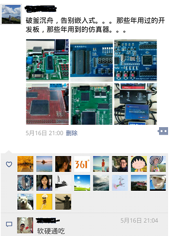

<!---title:侃侃自己的IT面试经历-->
<!---keywords:写作-->
<!---date:2015-10-07-->

我所在的实验室是做物联网的，研究生2年都在捣鼓画PCB，玩DSP与FPGA，还常常得和快速傅立叶变换这些玩意儿打交道。虽然也感觉做得不错，而且老有人说，“培养一个硬件工程师那得花多少钱，都干了这么久不干了很可惜”，这话没错，我的这点硬件经验不知道是烧了多少板子(那都是白花花的银子啊)给烧出来的！我大四做过一年的图像处理，机器学习也就了解一些。找工作，确定心态和方向很重要，一旦确定方向就要有破釜沉舟的决心，不急不躁，边找工作边不忘继续学习。当然，怎么去给自己定心态和方向，这依人的性格而定，我反正是四“边”：边实习、边学习、边面试，还不忘边玩。下面图是自己在放弃嵌入式时下的决心，发了一条朋友圈。

我找工作的方向是图像处理或机器学习，对应到一些大公司的职位一般是算法工程师。实习在三星中国研究院，做的是图像分割和深度学习相关。找正式工作时，只去了滴滴的宣讲会（最后还没投），只面了4家IT企业（阿里、腾讯、网易、爱奇艺），拿到其中3家（阿里、网易、爱奇艺）的算法工程师offer。我个人比较容易满足，这结果也令我满意。这里再聊点题外话，不管在研究生项目过程中还是在三星实习，踏实努力是我的常态，所以也得到了三星研究院和兵器工业的青睐，希望我到他们那边去工作。由于我本人不想留北京也不想去国企而直接放弃了这两个机会，说这个题外话的除了自夸一下更想要说明的是，“时刻保持踏实努力的常态，机会总会自动找上门”！

阿里经历了5面（1/2/3面+交叉面+Hr面），因为我在北京面的是杭州的岗位，采用电话面试，每轮大概半个小时，普遍来说问的问题都比较简单。抱歉，又插个题外话，我简历写得比较多(3页)，有人说简历要写得不超过一页，我觉得那是人云亦云的屁话(学理工科的人要学会变通下，不要死扣这些原则定理好不好！)，我觉得之所以一直流传有这么个观点是因为很多人的简历让Hr抓不到重点，如果你有很多成果，放心大胆地写出来，不要长篇累牍就好，这里推荐描述项目的时候使用STAR法则，清晰，一目了然。阿里一上来都是拿着我的简历问项目，而且抠着一个项目逐步深入。我很多项目都用过SVM，交叉面的面试官依次问了我下面的问题：

1. 请说一下SVM的原理？然后我提到了怎么去找分类的超平面，并用二维的例子举例说明了下，然后主动谈到了应付过拟合的问题。
2. 样本点线性不可分时候怎么办？SVM是怎么应对少数错分的点的(不记得怎么描述了，大概是这个意思)？核函数映射的方法可以应对线性不可分，然后我主动谈到RBF核等方法，并提到了操作过程中核函数映射会使内存和运算复杂度提高等实际问题。针对少数错分点，如果强行进行拟合，肯定会造成过拟合，此时应该增加惩罚项，云云……反正回答越详细能举例子解释清楚越好。
3. 我当时正在做Deep Learning相关的项目，面试关让我解释了Caffe、GPU的一些东西，这些只要有过实践经验，都很简单。然后问我是否Deep Learning要比SVM效果要好？肯定不是，(1)数据量不足的时候，DL很容易过拟合，显然DL不好; (2)对于简单的问题，如果能用SVM甚至更简单的Logistic Regression解决，没必要用时间和空间复杂度高那么多的DL

阿里前1/2面的面试官问了我的研究生课题，我聊了一些硬件的东西，能听出他们可能不是太懂，所以我就像聊天一样。为方便面试官理解，比如说道DSP，就拿手机上的CPU作例子。阿里那边是做云计算的，面试官问到了我云计算的东西，我直接跟面试官解释说没接触过云计算的项目，不懂。然后因为我之前参加了AWSomeDay的一天的培训，跟面试官说了我参加培训的事，聊了下AWS下的计算资源EC2和存储资源S3等等。总之，不管面试官懂不懂，面试官问的问题自己会不会，面试时都要诚心实意，要把面试官当朋友对待，要不失矜持、大大方方地展现自己，不懂就是不懂不要装懂，但也不用隐瞒自己除专业外其它方面的才能。

腾讯面的是上海的优图，毕竟研究生2年都没有任何图像相关的成果（论文），当时也是抱着试一试的心态。虽然没过，但面试官很专业也很敬业，一面问了下面一些问题：

1. SIFT的原理。问得很细，从怎么保证不变性，到怎么做尺度空间，怎么求极值，感觉就差一个一个公式推导了。
2. SVM的优缺点？为什么只适合于做二分类？
3. Newtown优化还是SGD优化的问题，SGD的原理，两者的优缺点？也是要能理解公式才能解释清楚，知乎上有个对比挺不错的 <http://www.zhihu.com/question/19723347>
4. 我有一个图像语义分割的项目用到了Bag of Words，面试官问我怎么构造Bag of words

腾讯还有一面是现场面的，让我推导解释项目里面用到的条件随机场（CRF），神经网络中的BP算法，能画出BP算法的流程图，会前向传播和后向传播的公式推导。让我用C或C++实现图像的边界跟踪（纸上写代码，可以用opencv的mat结构，但不能调用opencv的算法），这个确实一时把我难倒了，在我映像中，图像的边界跟踪（本科时用matlab做过所以知道里面的弯弯绕绕）一直是实现起来比较麻烦的一件事情。最后还是让我用C++写了个二值图像寻找联通区域的代码，用数据结构里的“图的广度优先遍历”算是完成了，但里面有一个可能使程序陷入死循环的问题没注意，面试官还提醒了下我，一时没找出来，却在面完后出大楼的时候想起来了，哎。

爱奇艺（在北京）本来没打算投，一个老师推荐的又不好意思不去，直接带着纸质简历就过去了也没在线填什么简历。共面了3次，都是现场面，一面是和一个负责人直接聊的（好像那时爱奇艺还没开始内推，因为老师推荐了所以先过去聊聊），1个小时，也是聊聊我的实习项目和研究生课题，然而让我说说SGD的原理，我开始写公式解释，他让我“不要一上来就写公式，直观解释”，然后我就画了一个二维的曲线，说明SGD是怎么沿着曲线的切线方向下降的。然后出了一个数学题，大概就是均匀分布的最大似然估计，还有利用反正法的证明题（这个一开始没做出来，他提醒了用反证法才做出来）。一面面完那个负责人就直接说“还不错”，然后等通知。二面也是项目+一道概率题（有点考智商的那种），在解概率题时我傻傻地用数学求极值的方法去解，半天推导出一个多变量的求极值问题，然后卡在那里了，这时面试官提醒我从感性的角度去分析，然后在面试官的引导下，一步一步地和面试官边讨论边解（不懂的就问），虽然中间有些外推的过程不是很严谨(主要是我自己不信服，然后面试官还给我解释)，但总算得到了结果。挺可爱的一个技术哥们，还问了问我阿里offer和网易offer的事。三面面试官看到我的简历里有一个卷积网络做图像语义分割的项目，她是做人脸识别的（对分割不是太懂），于是让我画出用到的全卷积(FCNN)的网络图，让我解释了利用FCNN怎么做分割以及FCNN的一些细节。三面面试官对我的回答都还挺满意的，最后送我出来，怕我不留北京还问我有没有女朋友，也就笑了笑。

网易面得还算比较早，8月下旬就开始面，差不多到9月底才面完，2技术面+Hr面。一面电话面，也是从简历出发，问了期望最大化(EM)算法，压缩感知，怎么并行化CNN网络（先说明了下没做过CNN的并行，然后谈到和同学讨论的使用好像用到ParameterServer共享参数的思想），问了FCNN做图像分割的项目。二面视频面，但因为网络信号不好，面到一半转电话面的，和面试官聊了聊FCNN做图像语义分割的项目，问了我一些网络调参（学习率等）的技巧，相对来说，感觉还是比较容易的。网易的面试官都比较和蔼可爱，稍微有些地方没解释得太清楚的时候，他们会说没关系。一面大概20分钟，二面本来是半个小时的，但最后差不多聊了40分钟，反正说着说着思维就开阔了。在网易Hr面的时候，情绪有些激动，说了很多在完成项目过程中的经历，然而，最后Hr只问了我一个问题，“你做了很多工程项目，怎么证明你适合研究的工作？”（我投的是网易杭研院）。其实我很早就考虑过研究和工程的问题，我本人是比较偏中庸的，不管别人说数学有没有用，但我的亲身体会是“多懂些数学，在具体开发过程中能够起到事半功倍的作用”，但也要“知行合一”，所以我平时也非常重视如何将数学理论应用到工程中的问题。

在满足不泄露公司机密的情况下，以上是暂时能记起来的一些东西，大概总结一下（仅个人的观点和态度）：

1. 简历很重要，知道的一定要写，不知道的或一知半解(半吊子)的千万别往上写，项目稍微详细一点(3-5)没关系，目的是要做到利用简历方便和面试官沟通
2. 面试态度很重要，不骄不躁，诚恳，解释某个算法的时候举例说明能更直观
3. 功夫还在平时，别梦想着能考试突击一样拿高分。普遍来说，感觉自己发挥不算非常好，也就“差不多差不多”那种水平，刚好被录了
4. 学会换位思考一下，如果你是面试官，看到你的简历，会想考察你的什么能力（是知识点，还是能迅速学习的能力）
5. 坚持学习，不要用功利的目的去看待学习。“终于面完了，我现在终于可以开始刷leetcode，啃prml，读《明朝那些事》《激荡三十年》了……”