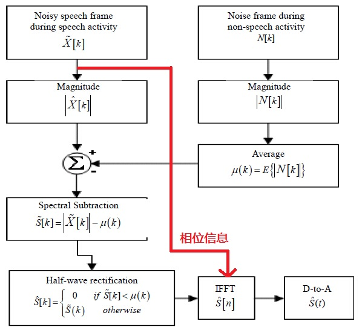
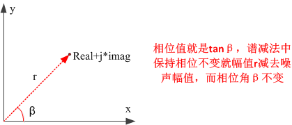

<!---title:基于谱减法的声音去噪-->
<!---keywords:谱减法-->
<!---date:2014-11-14-->

## 谱减法模型

实际听觉环境中，肯定是含有噪声的，那掺杂有噪声的声音信号中原声音信号和噪声信号是如何体现的呢？一种普遍被使用的方法是：采集到的声音信号永远都是原信号与噪声信号的叠加，即


模型是信号的直接叠加，这就要满足：原信号与噪声信号不相关。其实有些情况下这个条件是不满足的，所以依然有很多其他的模型，如有人认为原信号和噪声信号是卷积的关系。当然，这些都是模型，还没有明确的理论证明那种是对的，反正哪种好用我们就捡谁。谱减法就是基于噪声的加法模型。

语音信号本身是非平稳过程，但假如取很短的一段（10~30ms），则具有短时平稳特性。因此，使用窗函数取含噪语音信号的一帧（N点）进行处理。信号叠加模型两边同时进行傅里叶变换，并取模，


则对原信号幅值的估计就可通过|S(k)|=|Y(k)|-|N(k)|求得，但仅这样存在2个问题：

1.	|S(k)|可能为负值，语音信号的FFT谱幅值怎么可能为负值呢
2.	|S(k)|中不包含相位信息，必需在取模时同时保留相位信息

因此，谱减法考虑到这两点，其流程如下：



在语音增强的应用中，由于人耳对相位信息的感知不敏感，信号恢复时仍使用的相位信息为带噪信号的相位，相位信息保存在哪里呢？我们知道FFT的结果是复数，


$\phi(w)$ 就是相位，具体一些，复数在直角坐标系上表示，



在上面的谱减法流程中，考虑噪声的高斯分布特性，用噪声的均值E[N(k)]替换N(k)，考虑减完后可能为负值的情况，将值小于0的部分全部截断为0，这样处理虽然带来一定的方便性，但同时引入了新的噪声，习惯上称之为“音乐噪声”。通过FFT谱进行谱减法并不是最普遍的方法，更多情况下是用功率谱代替FFT谱。


## Matlab的谱减法实例

```matlab
clc
clear all;

% 选择.wav音频文件
[fname,pname]=uigetfile(...
    {'*.wav';'*.*'},...
    'Input wav File');
[x,fs] = audioread(fullfile(pname,fname));

x = x(1:8912,1);     % 如果是双声道，取单通道
N = length(x);       % 帧长
max_x = max(x);
noise_add = random('norm', 0, 0.1*max_x, [N,1]);

% 添加高斯噪声
y = x + noise_add;
noise_estimated = random('norm', 0, 0.1*max_x, [N,1]);
fft_y = fft(y);
fft_n = fft(noise_estimated);
E_noise = sum(abs(fft_n)) / N;
mag_y = abs(fft_y);
phase_y = angle(fft_y);   % 保留相位信息
mag_s = mag_y - E_noise;
mag_s(mag_s<0)=0;

% 恢复
fft_s = mag_s .* exp(1i.*phase_y);
s = ifft(fft_s);

subplot(311);plot(x);ylim([-1.5,1.5]);title('原始干净信号');
subplot(312);plot(y);ylim([-1.5,1.5]);title('加噪信号');
subplot(313);plot(real(s));ylim([-1.5,1.5]);title('谱减法去噪后信号');
```


上图取了一段wav文件的脚步声，从第二张图到第3张图，有一些去噪效果，但信号本身也有衰减。谱减法应用范围还是很有限，在实际应用中，主要限制在环境噪声的特性上大部分情况不是简单的高斯特性，而且也很难满足噪声加法模型，另外，在谱减之后截断为0引入的新的音乐噪声至今没办法完全解决。但在高SNR的条件下，使用谱减法进行语音信号的增强确也能达到不错的效果。

## 参考文献

1.	Navneet Upadhyay etc. Spectral Subtractive-Type Algorithms for Enhancement of Noisy Speech: An Integrative Review. 2013.
2.	林琴，张道信，吴小培. 一种基于改进谱减法的语音去噪新方法. 计算机技术与发展, 2007年7月.
3.	Marc Karam, Hasan F. Khazaal, Heshmat Aglan, Cliston Cole. Noise Removal in Speech Processing Using Spectral Subtraction. Journal of Signal and Information Processing, 2014, 5, 32-41.