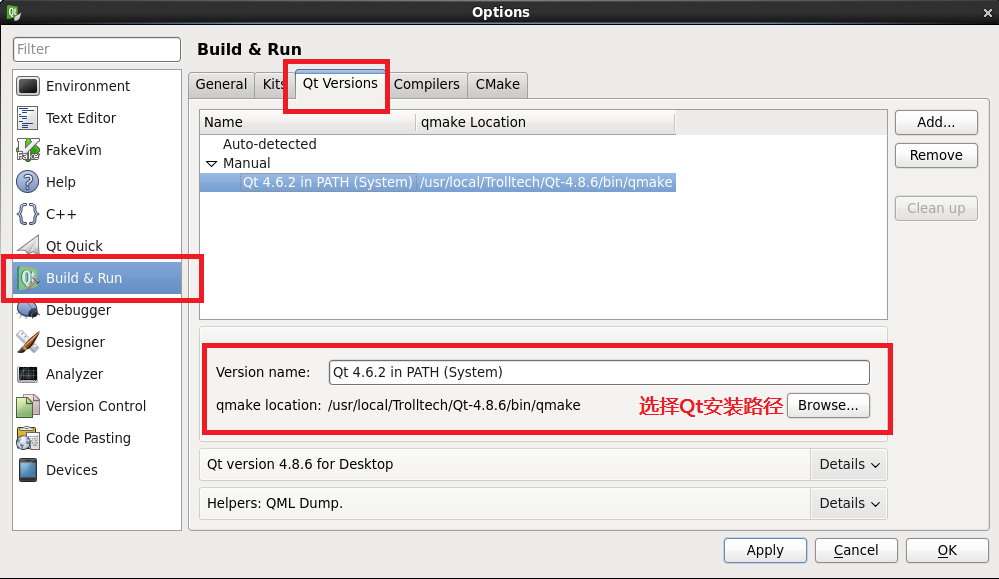
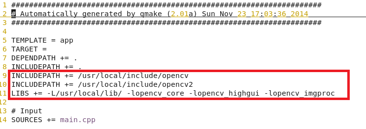

<!---title:搭建Qt界面的OpenCV开发环境-->
<!---keywords:OpenCV,Qt,gcc-->
<!---date:2014-11-22-->

OpenCV包含了大量的机器视觉处理算法，虽然也提供了highgui的界面功能，但实在有限（也就是一个窗口，加一些使用像素进行绘图的方法），与用户交互相关的功能极少（比如有Trackbar），貌似连个可视化的用户接口的button也没见过，而Qt正好能弥补OpenCV在这些方面的不足：通过OpenCV完成底层算法，用Qt完成上层的应用接口，哇咔，这不是完美组合么！本文原来的初衷是想通过Qt开发来实战练练C++，现在看来是要Qt与OpenCV一起搞了。这篇文章就是安装Qt及在Qt中配置OpenCV的开发环境。

安装Qt存在的一个普遍的问题是：低版本的gcc可能无法编译高版本的Qt。我参照了[博客园中的一篇博客](http://www.cnblogs.com/lit10050528/p/3936589.html) ，搭配使用Qt4.8.6+QtCreator2.6.1+gcc4.9.2，这些软件的下载链接依次是：

1.	qt-everywhere-opensource-src-4.8.6.tar.gz: <http://download.qt-project.org/official_releases/qt/4.8/4.8.6/>
2.	qt-creator-linux-x86_64-opensource-2.6.1.bin: <http://download.qt-project.org/official_releases/qtcreator/2.6/2.6.1/>
3.	gcc-4.9.2: <http://mirror.bjtu.edu.cn/gnu/gcc/>

根据自己的机器环境选择下载，我的环境是：CentOS 6.5 64bit。qt-creator仅仅是Qt开发啊的IDE环境，qt是指包含相关程序的开发库，两者是不同的。在使用Qt开发的过程中完全可以通过vi+命令行的方式搞定，一开始为了能更深入一些，我也是这样做的。但在之后的实际开发中，由于qt-creator提供语法高亮，快速定位源码等很好用的功能，推荐直接使用qt-creator这个集成开发环境。上面gcc链接的镜像是来自北交大，也可以自己选择镜像下载（我用的是学校的ftp）。

## 1. 更新gcc到4.9.2

进入gcc解压包所在目录，

```shell
mkdir gccout                       " 新建一个目录用于保存编译gcc生成的文件
cd gccout                          " 在gccout目录中运行所有命令
../contrib/download_prerequisites  " 安装一些依赖项
../configure --prefix=/usr/local --mandir=/usr/local/share/man --enable-checking=release --enable-languages=c,c++,java --enalbe-java-awk=gtk --disable-multilib
make -j4                           " 编译，大约半个多小时吧，看机器性能了
make install                       " 安装，很快，几十秒
```

按上面的--prefix配置，gcc4.9.2会安装到`/usr/local`目录下，系统原来会有旧版本的gcc（要安装新版gcc必须要求系统中已经含有gcc，这样才能编译gcc源码），因此还要更新gcc到刚安装的4.9.2，则

```shell
su root                            " 切换到root
cd /usr/bin/
mv gcc gcc477                      " 将旧版本的gcc软链接重命名，还可以通过gcc477使用旧版gcc
mv g++ g++477                      " 将旧版本的g++软链接重命名，还可以通过g++477使用旧版g++
ln -s /usr/local/bin/gcc gcc       " 将gcc链接为gcc4.9.2
ln -s /usr/local/bin/g++ g++
```

## 2. 编译安装Qt-4.8.6

解压缩之后，进入Qt目录，

```shell
./configure
make                                     " 编译时间很长，2个多小时吧
make install
```

我第一次编译中途遇到一个error，提示没有gstream，我使用yum直接就更新了，

```shell
yum install gstream*
```

再接着`make`就成功了。接着要使用Qt还要配置Qt所在的路径（即环境变量），

```shell
cd /etc/profile.d/      " 这个目录中各种环境变量
vi qt4.sh               " 新建一个环境变量配置文件
```

在`qt4.sh`中添加如下的信息，当然，Qt默认安装目录是在`/usr/local/Trolltech/Qt-4.8.6`，我没有改（改过的修改`QTDIR`变量就好了），

```
export QTDIR=/usr/local/Trolltech/Qt-4.8.6
export PATH=$QTDIR/bin:$PATH
export MANPATH=$QTDIR/man:$MANPAT
export LD_LIBRARY_PATH=$QTDIR/lib:$LD_LIBRARY_PATH
```

最后通过`source /etc/profile`使配置的环境变量生效就OK了。

## 3. 安装qt-creator-2.6.1

因为下载的qtcreator是bin格式文件，因此直接在shell中运行，

```shell
./qt-creator-linux-x86_64-opensource-2.6.1.bin
```

安装过程同Windows下一样，提示安装目录，我保留默认的`opt/qtcreator`。安装好后在CentOS的启动栏菜单中就能看Qt-creator了。但要让qt-creator配合Qt4.8.6使用，则还要再qt-creator中进行一些配置，执行qt-creator菜单栏`Tools->Option...`，配置如下图：




这时就可以使用qt-creator新建Qt工程了。然而，我们下面的例子却不打算这么做。除非你是高手，否则我们应该使用命令行而非qt-creator来进行工程规划，qt-creator仅仅是为那些为了赶时间的设计师准备的！

## 4. Qt与OpenCV强强联合的牛刀小试

这时我们可以写个小程序小小体验一把了，我们来写个程序实现：通过Qt弹出文件选择对话框，然后用OpenCV中的imread函数读取图片，最后通过Qt界面将图片显示出来。

其中的困难点在于Qt的图片数据类型QImage格式与OpenCV的Mat格式不一致，因此要实现转换，这通过下面的函数实现Mat到QImage的转换，打开文件对话框和显示图片的代码都在main函数中，下面是源代码：

```cpp
/*
 * FileName : main.cpp
 * Author   : xiahouzuoxin @163.com
 * Version  : v1.0
 * Date     : Sun 23 Nov 2014 04:29:47 PM CST
 * Brief    : 
 * 
 * Copyright (C) MICL,USTB
 */
#include <QApplication>
#include <QWidget>
#include <QImage>
#include <QLabel>
#include <QPushButton>
#include <QHBoxLayout>
#include <QVBoxLayout>
#include <QFileDialog>

#include <cv.h>
#include <highgui.h>

using namespace cv;

static QImage Mat2QImage(Mat& image)
{
    QImage img;

    if (image.channels()==3) {
        cvtColor(image, image, CV_BGR2RGB);
        img = QImage((const unsigned char *)(image.data), image.cols, image.rows,
                image.cols*image.channels(), QImage::Format_RGB888);
    } else if (image.channels()==1) {
        img = QImage((const unsigned char *)(image.data), image.cols, image.rows,
                image.cols*image.channels(), QImage::Format_ARGB32);
    } else {
        img = QImage((const unsigned char *)(image.data), image.cols, image.rows,
                image.cols*image.channels(), QImage::Format_RGB888);
    }

    return img;
}

int main(int argc, char *argv[])
{
    QApplication app(argc, argv);

    QWidget *wn = new QWidget;
    wn->setWindowTitle("disp image");

    QString filename = QFileDialog::getOpenFileName(0, "Open File", "", "*.jpg *.png *.bmp", 0);
    if (filename.isNull()) {
        return -1;
    }

    Mat image = imread(filename.toAscii().data(), 1);
    QImage img = Mat2QImage(image); 

    QLabel *label = new QLabel("", 0);
    label->setPixmap(QPixmap::fromImage(img));

    QPushButton *bnt = new QPushButton("Quit");
    QObject::connect(bnt, SIGNAL(clicked()), &app, SLOT(quit()));

    QVBoxLayout *layout = new QVBoxLayout;
    layout->addWidget(label);
    layout->addWidget(bnt);
    wn->setLayout(layout);

    wn->show();

    return app.exec();
}
```

关键是上面的代码直接在Qt中能编译吗？肯定不行，用脚趾头想想就知道，Qt怎么能找到`cv.h`这些头文件呢，又怎么能找到`imread`这些OpenCV中的函数呢！

因此我们要在Qt中使用OpenCV，我们必需要将OpenCV头文件的路径和`imread`函数的库和库路径告知Qt，如果你一直像我一样使用的是Makefile来编译OpenCV工程，那将OpenCV集成到Qt中的那真是小菜一碟了。我们先用`qmake -project`命令生成`pro`文件，[`.pro`文件](http://qt-project.org/doc/qt-4.8/qmake-project-files.html)在Qt工程中起重要作用。要在Qt中使用OpenCV，我们只要修改`pro`文件就好了，



从上图知，我们在`pro`文件的`INCLUDEPATH`变量中添加了OpenCV头文件所在路径，在`LIBS`变量中添加了库所在路径及所使用的库（-L指定库路径，-llib指定程序中用到的lib库）。修改完`pro`文件保存后，这个时候再使用`qmake`命令编译，就可以生成Makefile文件，执行`make`就得到可执行文件了。我们不妨看看执行显示图片的结果。


整理一下上面编译Qt程序依次用到的命令（其实就3个），

```shell
qmake -project         " 生成pro文件，修改后执行下面的命令
qmake                  " 生成Makefile文件
make                   " gcc编译生成目标可执行文件，可执行文件名默认为当前目录名
```

这个例子的[cpp源码及pro文件下载](../enclosure/搭建Qt界面的OpenCV开发环境/disp_img.zip)。


