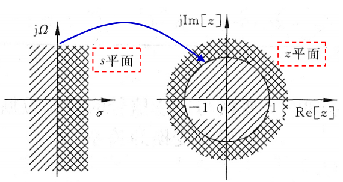

### 4种频率及其数量关系

实际物理频率表示AD采集物理信号的频率，fs为采样频率，由奈奎斯特采样定理可以知道，fs必须≥信号最高频率的2倍才不会发生信号混叠，因此fs能采样到的信号最高频率为fs/2。

角频率是物理频率的2*pi倍，这个也称模拟频率。

归一化频率是将物理频率按fs归一化之后的结果，最高的信号频率为fs/2对应归一化频率0.5，这也就是为什么在matlab的fdtool工具中归一化频率为什么最大只到0.5的原因。

圆周频率是归一化频率的2*pi倍，这个也称数字频率。

### 有关FFT频率与实际物理频率的分析

做n个点的FFT，表示在时域上对原来的信号取了n个点来做频谱分析，n点FFT变换的结果仍为n个点。

换句话说，就是将2pi数字频率w分成n份，而整个数字频率w的范围覆盖了从0-2pi*fs的模拟频率范围。这里的fs是__采样频率__。而我们通常只关心0-pi中的频谱，因为根据奈科斯特定律，只有f=fs/2范围内的信号才是被采样到的有效信号。那么，在w的范围内，得到的频谱肯定是关于n/2对称的。
 
举例说，如果做了16个点的FFT分析，你原来的模拟信号的最高频率f=32kHz，采样频率是64kHz，n的范围是0,1,2...15。这时，64kHz的模拟频率被分成了16分，每一份是4kHz，这个叫__频率分辨率__。那么在横坐标中，n=1时对应的f是4kHz, n=2对应的是8kHz, n=15时对应的是60kHz，你的频谱是关于n=8对称的。你只需要关心n=0到7以内的频谱就足够了，因为，原来信号的最高模拟频率是32kHz。
 
这里可以有两个结论。

- 第一，必须知道原来信号的采样频率fs是多少，才可以知道每个n对应的实际频率是多少，__第k个点的实际频率的计算为f(k)=k*(fs/n)__
- 第二，你64kHz做了16个点FFT之后，因为频率分辨率是4kHz，如果原来的信号在5kHz或者63kHz有分量，你在频谱上是看不见的，这就表示你越想频谱画得逼真，就必须取越多的点数来做FFT，n就越大，你在时域上就必须取更长的信号样本来做分析。但是无论如何，由于离散采样的原理，你不可能完全准确地画出原来连续时间信号的真实频谱，只能无限接近（就是n无限大的时候），这个就叫做__频率泄露__。在采样频率fs不变得情况下，频率泄漏可以通过取更多的点来改善，也可以通过做FFT前加窗来改善，这就是另外一个话题了。

### 离散信号傅里叶变换的周期性讨论

要分析这个，我们先从Laplace变换与Z变换之间的关系谈起。

由，得z平面与s平面的关系图

图中的关系有以下几点：

- s平面的虚轴映射到z平面的单位圆上
- s平面的负半轴映射到z平面的单位圆内
- s平面的正半轴映射到z平面的单位圆外

Laplace变换是用于连续信号的变换，相对应的z变换是应用到z平面的变换。因此从另一个角度，上面谈到的__角频率（模拟频率）对应的是s平面，圆周频率对应的是z平面__（也是为什么称为圆周频率的原因）。

现在我们来看一下s平面虚轴上模拟频率的变换将会导致z平面单位圆上如何变化：

- 当模拟频率在s平面的虚轴上从0变到fs 时，数字频率在z平面单位圆上从0变到2 pi。
- 当模拟频率在s平面的虚轴上从2fs变到4fs时，数字频率在z平面单位圆上仍然从0变到2 pi。
- 。。。。。。z平面如此循环重复

我们知道__离散信号的傅里叶变换对应到单位圆上的z变换__，因此上面的结论就验证了为什么离散信号的傅里叶变换是周期性：根本原因所是单位圆上的周期性。

考虑到我们实际应用中可选择一个周期，这也能够解释：因为实际信号的频率总是在fs/2以下，这就对应到z平面单位圆上的0~pi，在一个周期范围内就可以进行信号分析了。