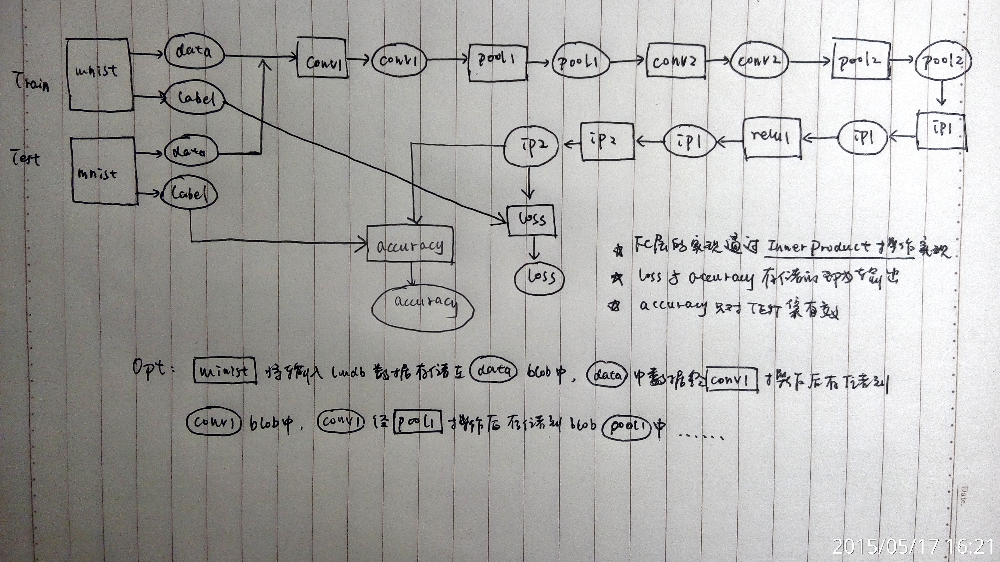
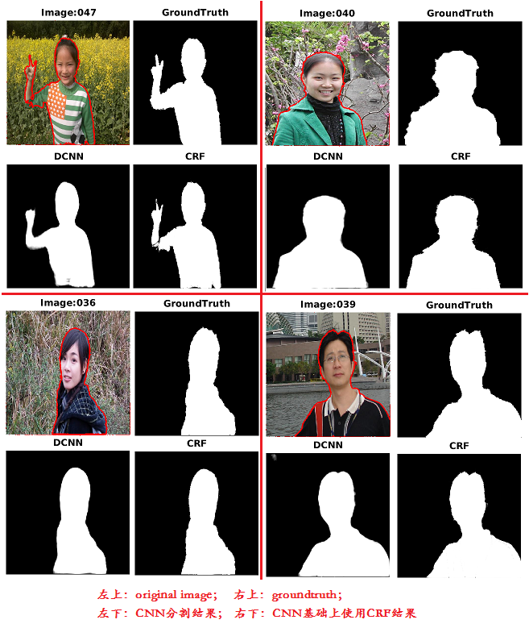
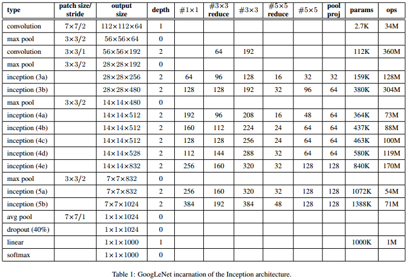
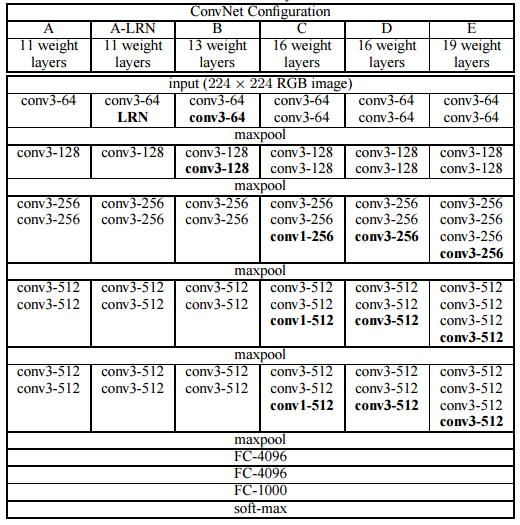

<!---title:深度卷积网络CNN与图像语义分割-->
<!---keywords:CNN-->
<!---date:2015-08-16-->

说好的要笔耕不缀，这开始一边实习一边找工作，还摊上了自己的一点私事困扰，这几个月的东西都没来得及总结一下。这就来记录一下关于CNN、Caffe、Image Sematic Segmentation相关的工作，由于公司技术保密的问题，很多东西没办法和大家详说只能抱歉了。在5月份前，我也是一个DL和CNN的门外汉，自己试着看tutorials、papers、搭Caffe平台、测试CNN Net，现在至少也能改改Caffe源码（Add/Modify Layer）、基于Caffe写个Demo。这里希望把学习的过程分享给那些在门口徘徊的朋友。没法事无巨细，但希望能起到提点的作用！

## 级别1：DL快速上手

1. UFLDL： <http://deeplearning.stanford.edu/tutorial/>

	这是stanford Ng老师的教材，也刚好是以CNN为主，Ng老师教材的特色就是简洁明白。一遍看不懂多看两遍，直到烂熟于心，顺便把里面的Matlab Exercises完成了。
	
2. <http://deeplearning.net/tutorial/>

	PRML作者给的python入门DL的tutorial，基于Theano Framework，有些偏向于RNN的东西。

一句简单的话描述：“深度学习就是多层的神经网络”。神经网络几十年前就有了，而且证明了“2层（1个隐层）的神经网络可以逼近任意的非线性映射”，意思就是说，只要我的参数能训练好，2层神经网络就能完成任意的分类问题（分类问题就是将不同类通过非线性映射划分到不同的子空间）。但2层神经网络存在的问题是：

> 如果要逼近非常非常复杂的非线性映射，网络的权值W就会很多，造成Train时候容易出现的问题就是Overfitting。所以大事化小，将复杂问题进行分割，用多层网络来逼近负责的非线性映射，这样每层的参数就少了。自然而然的网络就从2层变成了多层，浅网络(shallow)就变成了深网络(deep)。


但科研界的大牛们会这么傻吗，十几年前会想不到用多层网络来进行非线性映射？看看CNN最早的工作： <http://yann.lecun.com/exdb/publis/pdf/lecun-98.pdf> 那是98年的，Train了一个5层的CNN来进行MINIST数据集的数字图片分类。多层神经网络一直不火我觉得有这么两个原因：

1. 神经网络中非线性的映射的极值优化问题本身是一个非凸问题，本身数学理论上的就对非凸优化问题缺少严格有效最优化方法的支撑。直到现在也依然对各层Layer的输出解释不清不楚，但效果就是好，这还得归功于各种大神藏之捏之的各种Tricks
2. 数据与计算能力的问题。十来年前哪来随随便便就这么大的硬盘，哪里去找像[ImageNet](http://www.image-net.org/)这样1000类的数据集。“大数据是燃料，GPU是引擎”，正是因为大数据的出现和GPU编程的出现带动了DL的进展，这些在10年前是做不来的。我在CPU与GPU上跑自己简化的[Googlenet](http://arxiv.org/abs/1409.4842)，GPU比CPU快10倍。

DL只是一个概念而已。对于做图像和视觉的就该一头扎到CNN(Convolutional Neural Netwok)，做自然语言的就该投入到RNN(Recurrent Neural Network)。我是做图像的。CNN的学习资料除了上面Ng的tutorial外，还有一个Stanford Li Fei-Fei教授的课程cs231：[Convolutional Neural Networks for Visual Recognition](http://vision.stanford.edu/teaching/cs231n/)，<http://cs231n.github.io/convolutional-networks/> 是Notes中一份关于CNN非常详细的资料。

## 级别2：从Caffe着手实践

先看看这个热个身：[贾扬清：希望Caffe成为深度学习领域的Hadoop](http://www.csdn.net/article/2015-07-07/2825150)，增加点学习的欲望，毕竟现在多少人靠着Hadoop那玩意儿挣着大钱。

接着请认准Caffe官方文档： <http://caffe.berkeleyvision.org/> 和Github源码： <https://github.com/BVLC/caffe> 。毫不犹豫fork一份到自己的Github。然后就是照着[INSTALL](http://caffe.berkeleyvision.org/installation.html)来Complie和Config Caffe了，值得注意的是，安装OpenCV的时候推荐使用源码安装。

先自己熟悉Caffe的架构，主要参考资料就是官网文档，我自己刚开始的时候也写了个小的ppt笔记：[Diving into Caffe.pptx](http://xiahouzuoxin.github.io/notes/enclosure/Diving into Caffe.pptx)

接着就是实实在在地分析一个CNN，比如LeNet、AlexNet，自己在纸上画一画，下面那样




## 级别3：读paper，网络Train起来

当去搜索ICRL、CVPR、ICCV这些最前沿的计算机视觉、机器学习会议的时候，只要是涉及图像相关的深度学习实验，大都是基于Caffe来做的。所以，只要抓住1~2篇popular的paper深入，把论文中的CNN在Caffe上复现了，就能找到一些感觉了。在这期间，下面一些论文是至少要读的：

1. LeNet-5: [Gradient-Based Learning Applied to Document Recognition](http://yann.lecun.com/exdb/publis/pdf/lecun-98.pdf)
	CNN首篇paper，虽然是1998年的文章，但依然值得仔细一读。
2. AlexNet: [ImageNet Classification with Deep Convolutional Neural Networks](http://www.cs.toronto.edu/~fritz/absps/imagenet.pdf)
	自我感觉是促进CNN的扛鼎之作，似乎很多所谓的Tricks在这篇文章中能找到，看这篇文章就是来学Tricks的。
2. Googlenet: [Going Deeper with Convolutions](http://www.cv-foundation.org/openaccess/content_cvpr_2015/papers/Szegedy_Going_Deeper_With_2015_CVPR_paper.pdf)
	ImageNet竞赛Number1，有效的Inception结构构建深层网络
3. VGGNet: [Very Deep Convolutional Networks for Large-Scale Image Recognition](http://arxiv.org/abs/1409.1556)
	ImageNet竞赛Number2，典型的卷积+Pooling方式构建深层网络，但是由于没有Googlenet中Inception的1x1的convolution用于减小网络厚度，世间上要比Googlenet慢一些。
	
具体到用CNN做Sematic Segmentation，利用到全卷积网络，对下面两篇进行了精读，并且都Caffe上复现过并用于分割任务，

1. FCNN: [Fully Convolutional Networks for Semantic Segmentation](http://www.cs.berkeley.edu/~jonlong/long_shelhamer_fcn.pdf)
2. Deeplab: [Semantic Image Segmentation with Deep Convolutional Nets and Fully Connected CRFs](http://arxiv.org/abs/1412.7062)

下面是几个月前我看过这两篇paper后做得ppt：

1. [FCN for Sematic Segmentation.pptx](http://xiahouzuoxin.github.io/notes/enclosure/FCN for Sematic Segmentation.pptx)
2. [Semantic Image Segmentation With Deep Convolutional Nets and Fully Connected CRFs.ppt](http://xiahouzuoxin.github.io/notes/enclosure/Semantic Image Segmentation With Deep Convolutional Nets and Fully Connected CRFs.pptx)

## 级别4：Demo跑起来

### 读一些源码玩玩

1. caffe.proto

2. Convolution Layer

3. SoftmaxLossLayer

4. DataLayer

5. 自己实现个IoULayer

### 熟悉Caffe接口，写Demo这是硬功夫

Caffe提供了好用的接口，包括matlab、C++、Python！由于特殊原因，我不能公开我C++和matlab的Demo源码以及其中的一些后处理技术，暂且只能给大家看一些分割的结果：




还有一个视频语义分割的结果，大家看看，热闹热闹就好，

<iframe height=498 width=510 src="http://xiahouzuoxin.github.io/notes/images/深度卷积网络CNN与图像语义分割/TG.mp4" frameborder=0 allowfullscreen></iframe>

### 分析各层Layer输出特征

我一开始以为看看各层Layer的输出，能帮助我改进Net，可却发现错了，除了前几层还能看出点明亮或边缘信息外，网络后端Layer的输出压根就没办法理解。[extract_featmat.cpp](http://xiahouzuoxin.github.io/notes/enclosure/深度卷积网络CNN与图像语义分割/extract_featmat.cpp)是我基于extract_features.cpp改的一个Caffe tool，放到tools目录下编译就好了，使用方法看help：

```cpp
  void print_help(void) {
    LOG(ERROR)<<
    "This program takes in a trained network and an input image, and then\n"
    " extract features of the input data produced by the net.\n"
    "Usage: extract_featmat [options]\n"
    "  -model     [pretrained_net_param]\n"
    "  -proto     [feature_extraction_proto_file]\n"
    "  -img       [rgb_image_name]\n"
    "  -blobs     [extract_feature_blob_name1[,name2,...]],refrence .prototxt with"
    "             \"blob:\". [all] for all layers. \n"
    "  -wr_prefix [output_feat_prefix1[,prefix2,...]], conrespond to -blobs\n"
    "  -wr_root   [output_feat_dir], optional, default \"./\", make sure it exist\n"
    "  -gpu       [gpu_id],optional,if not specified,default CPU\n";
  }
```

下面图是一些Layer的输出blob，从结果可以看出，前面的layer还能看到一些边缘信息，后面的layer就完全看不出原图像相关的信息了，


## 级别5：何不自己搭个CNN玩玩

虽然还是个新手，关于搭建CNN，还在慢慢在找感觉。我觉得从两方面：

1. 利用已有的网络，使劲浑身解数找它们的缺点，改进它们

	熟读Googlenet和VGGnet那两篇paper，两者的CNN结构如下：

	

	

	VGG不是Weight Filter不是非常厚么，卷积操作复杂度就高。而Googlenet通过Inception中1x1的Convolution刚好是为了减少Weight Filter的厚度，我最近一段时间在尝试做的事就是将VGG中的Layer用Googlenet中的Inception的方式去替代，希望至少在时间上有所改进。

2. 从头搭建一个CNN用于解决实际问题。一个词：搭积木。

	先搭一个简单的，比如说就3层：卷积-Pooling-卷积-Pooling-卷积-Pooling，先把这个简单的网络训练以来，效果不好没关系，我们接着往上加，直到满意为止。但是这里面有一个finetune的技巧，那就是用浅层的网络训练weight结果去初始化或finetune深层网络。这也是为什么不直接一开始就搭建深层网络的原因，级别1里就说过，深度网络的Train是个非凸问题，是个至今难解决的大问题，网络初始化对其收敛结果影响很大，finetune就这样作为Deep Network中一项重要的tricks而存在了。
	finetune除了由浅至深逐级初始化帮助收敛外，还有一个作用：将自己的网络在一个非常非常大的数据集上(现在最大的ImageNet)进行Train，这个Train的结果再拿去作为实际要解决的问题中用于初始化，这样能增加网络的泛化能力。
	然而，当Net遇到问题时，如何去改进？这是个大问题，不说现在没太多经验，有也是盲人摸象的感觉，暂且搁下不提，待后期多做实验分析整理，希望能有所收获。

就我现在的水平，最多也就修炼到这一级了。这一级还要多花功夫，读paper，多思考，继续练。。。

## 级别6：加速吧，GPU编程

呃，这个实在还没开始着手去做，但迟早是要做的，说了“大数据是燃料，GPU是引擎”的，怎么能不懂引擎呢……

## 关于语义分割的一些其它工作

1. CRF：CRF在图像分割中是最常见的refine后处理手段。在CNN中目标是做成end-2-end的CRF，实习这段时间也做过不少这部分的工作，Oxford有篇CRF-RNN的paper，将denseCRF重新解释成RNN来进行end-2-end的Training
2. 结合grabcut交互式分割，或者SLIC超像素分割等方法进行边缘精细化的处理
3. 不闲扯淡了……

---
注：由于“实习上班+实验室+论文+刷leetcode+私事”占用时间的关系，好不容易抽出一个上午+一个晚上整理了一下，暂时想到这么多，算列个提纲吧，文章中不少具体细节有机会再补充。