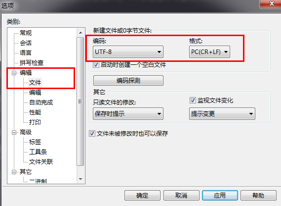

本目录为[html目录索引](index.md)，浏览[Markdown目录索引](README.md)请移步[Markdown目录索引](README.md)。

# 第一篇 分类目录

## 1 嵌入式

- DSP 	

	- [数字信号处理中各种频率关系](html/数字信号处理中各种频率关系.html)
	- [滤波器设计指标](html/滤波器设计指标.html)
	- [模拟信号采样与AD转换](html/模拟信号采样与AD转换.html)
	- [在DSP671x上使用Timer统计信号处理算法的时间消耗](html/在DSP671x上使用Timer统计信号处理算法的时间消耗.html)
	- [TMS320C6713烧写Flash的通用方法](html/TMS320C6713烧写Flash的通用方法.html)
	- [DSP连接不上CCS3.3的问题讨论](html/DSP连接不上CCS3.3的问题讨论.html)
	- [烧写Flash后的DSP程序运行不正常的情况分析](html/烧写Flash后的DSP程序运行不正常的情况分析.html)
	- [导出CCS3.3数据及使用matlab处理的方法](html/导出CCS3.3数据及使用matlab处理的方法.html)
	- [功率谱的一点理解](html/功率谱的一点理解.html)
	- [TI-DSP数学库之c67xmathlib的使用](html/TI-DSP数学库之c67xmathlib的使用.html)
	- [DSP/BIOS使用入门](html/DSP-BIOS使用入门.html)
	- [DSP/BIOS使用之初窥门径――滴答时钟及烧写Flash](html/DSP-BIOS使用之初窥门径――滴答时钟及烧写Flash.html)

- FPGA

	- [FPGA的复位](html/FPGA的复位.html)
	- [FPGA的边沿检测](html/FPGA的边沿检测.html)
	- [使用Tcl脚本分配FPGA管脚](html/使用Tcl脚本分配FPGA管脚.html)
	- [Quartus_ii中使用Testbench仿真的方法](html/Quartus_ii中使用Testbench仿真的方法.html)
	- [CycloneII系列FPGA结构](html/CycloneII系列FPGA结构.html)

- ARM

	- [基于SPI的双MCU通信](html/基于SPI的双MCU通信.html)

- 硬件设计

	- [高频总线上的串阻问题](html/高频总线上的串阻问题.html)
	- [FPGA与DSP通信中的EMIF速率问题](html/FPGA与DSP通信中的EMIF速率问题.html)
	- [设计DSP与FPGA数据采集硬件系统时遇到的一些问题整理](html/设计DSP与FPGA数据采集硬件系统时遇到的一些问题整理.html)
	- [低功耗模式下锂电池使用时长的估算](html/低功耗模式下锂电池使用时长的估算.html)
	- [AlteraFPGA功耗估计工具](html/AlteraFPGA功耗估计工具.html)
	- [EP2C8F256的官方原理图库存在问题](html/EP2C8F256的官方原理图库存在问题.html)
	- [PCB设计参考资料](html/PCB设计参考资料.html)
	- [三极管的电平转换及驱动电路分析](html/三极管的电平转换及驱动电路分析.html)
	- [DCDC纹波小实验](html/DCDC纹波小实验.html)
	- [运放参数解释及常用运放选型](html/运放参数解释及常用运放选型.html)
	- [使用Pspice进行电路仿真](html/使用Pspice进行电路仿真.html)
	

## 2 图像 音频 机器学习

- OpenCV

	- [CentOS上编译安装OpenCV-2.3.1与ffmpeg-2.1.2](html/CentOS上编译安装OpenCV-2.3.1与ffmpeg-2.1.2.html)
	- [OpenCV基础篇之读取显示图片](html/OpenCV基础篇之读取显示图片.html)
	- [OpenCV基础篇之使用CMake管理工程](html/OpenCV基础篇之使用CMake管理工程.html)
	- [OpenCV基础篇之Mat数据结构](html/OpenCV基础篇之Mat数据结构.html)
	- [OpenCV基础篇之像素访问](html/OpenCV基础篇之像素访问.html)
	- [OpenCV基础篇之图片叠加](html/OpenCV基础篇之图片叠加.html)
	- [OpenCV基础篇之像素操作对比度调节](html/OpenCV基础篇之像素操作对比度调节.html)
	- [OpenCV基础篇之查找表](html/OpenCV基础篇之查找表.html)
	- [OpenCV基础篇之绘图及RNG随机数对象](html/OpenCV基础篇之绘图及RNG随机数对象.html)

- 网络资源

	- [图像牛人链接及数据库资源](html/图像牛人链接及数据库资源.html)

## 3 数学 算法

- [数学牛人matrix67](http://www.matrix67.com/blog/)
- [数理统计知识整理――回归分析与方差分析](html/数理统计知识整理――回归分析与方差分析.html)
- [整数转字符串的一种快速实现](html/整数转字符串的一种快速实现.html)
- [转载@韩昊：傅里叶分析之掐死教程（完整版）](http://zhuanlan.zhihu.com/wille/19763358)
- 转载@StackExchange：常见算法在实际项目中的应用 [英文版 ](http://cstheory.stackexchange.com/questions/19759/core-algorithms-deployed/19773#19773)[中文版](http://blog.jobbole.com/52669/)
- [矩阵特征值分解与奇异值分解含义解析及应用](html/矩阵特征值分解与奇异值分解含义解析及应用.html)
- [循环的角度求均值](html/循环的角度求均值.html)
- [位反转算法](html/位反转算法.html)

## 4 计算机

- C/C++

	- [实例学习gcc+gdb+make](html/实例学习gcc+gdb+make.html)
	- [数组的指针特性](html/数组的指针特性.html)
	- [位运算的绝妙用法](html/位运算的绝妙用法.html)

- Matlab 

	- [Matlab的多线程工具Timer](html/Matlab的多线程工具Timer.html)
	- [Matlab中的笛卡尔坐标及极坐标](html/Matlab中的笛卡尔坐标及极坐标.html)
	- [matlab与C联合编程](html/matlab与C联合编程.html)

- Linux 

	- [Linux系统备份](html/Linux系统备份.html)
	- [增大虚拟机CentOS控制台大小](html/增大虚拟机CentOS控制台大小.html)
	- [设置CentOS启动默认进入控制台而不是图形界面](html/设置CentOS启动默认进入控制台而不是图形界面.html)
	- [CentOS在Win7下的硬盘安装](html/CentOS在Win7下的硬盘安装.html)
	- [CentOS更新yum源的方法](html/CentOS更新yum源的方法.html)
	- [CentOS配置smaba与Windows共享文件](html/CentOS配置smaba与Windows共享文件.html)
	- [CentOS安装中文字体](html/CentOS安装中文字体.html)
	- [Shell及VIM命令小技巧](html/Shell及VIM命令小技巧.html)

- Git

	- [Git的版本和分支管理](html/Git的版本和分支管理.html)
	- [Git使用补遗](html/Git使用补遗.html)

- 上位机

	- [LabVIEW上位机与串口通信](html/LabVIEW上位机与串口通信.html)

## 5 阅读 写作 其它

- 读书写作

	- [关于阅读的名言](html/关于阅读的名言.html)
	- [读塞缪尔《失实》](html/读塞缪尔《失实》.html)
	- [金庸武侠小说之我的见解](html/金庸武侠小说之我的见解.html)
	- [一首诗熟记三十六计](html/一首诗熟记三十六计.html)
	- [此心安处是吾乡――苏轼《定风波》](html/此心安处是吾乡――苏轼《定风波》.html)
	- [秋意](html/秋意.html)
	- [使用Markdown书写](html/使用Markdown书写.html)
	- [Markdown中插入数学公式的方法](html/Markdown中插入数学公式的方法.html)
	- [Latex入门](html/Latex入门.html)
	- [拾掇起来的年华](html/拾掇起来的年华.html)
	- [声波能从空气中穿透墙体传播吗](html/声波能从空气中穿透墙体传播吗.html)

- 读论文

	- [中国计算机学会推荐国际学术会议和期刊目录](http://www.ccf.org.cn/sites/ccf/paiming.jsp)
	

# 第二篇 说明

本工程中，未特殊说明的笔记全部原创，一字一字从键盘上敲出来的，转载请注明出处：<https://github.com/xiahouzuoxin>，谢谢！

笔记完全使用Markdown书写，并首先发布在[Github](https://github.com/xiahouzuoxin)，Github支持Markdown格式的预览，你可以直接在Github上无障碍的阅览。关于如何使用Markdown书写，可以参见我的笔记“[使用Markdown书写](essays/使用Markdown书写.md)”。

如果Download这些笔记到本地，则使用“使用Google浏览器+Markdown Preview Plus插件”的方式进行本地浏览：

1.	浏览Markdown格式笔记：，若要正常浏览文档中的公式，则必需确保网络连接正常，因为公式都使用到<http://www.forkosh.com/mathtextutorial.html>的Latex解析器。

2.	直接浏览html格式笔记

工程中文件目录的安排如下：

	README.md  Markdown文件索引目录

	index.md   html文件索引目录

	html/      所有笔记的html文本格式

	essays/    所有笔记的Markdown文本格式

	codes/     存放可供下载的代码

	images/    存放文档中的所有图片

	enclosure/ 存放可供下载的附件（pdf等）

笔记书写使用的编辑器是everedit（一款小巧的国产编辑器），文档的默认编码格式设置如下图（`工具->设置->常规`，在`编辑`选项中）：

本笔记中使用Chrome+Markdown Preview Plus插件将Markdwon转成html的方法：

使用Chrome打开md文件，在工具栏中选择`Markdown Preview Plus`插件，`Export to html`，将转成的html存放到目录`html/`下。修改index.md索引文件。

# 第三篇 关于我

1. 学历
	- 2009级本科：北京科技大学，电子信息工程专业
	- 2013级硕士：北京科技大学，计算机技术专业（保送）
2. 座右铭
	- 千淘万漉虽辛苦，吹尽狂沙始到金。    ――（唐）刘禹锡	
3. 联系邮箱（欢迎学习交流）
	- <xiahouzuoxin@163.com>
	- <g20138503@xs.ustb.edu.cn>

Created in 2014.03.